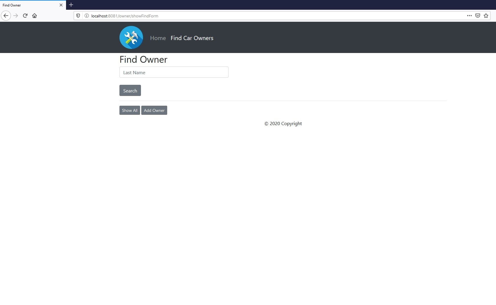
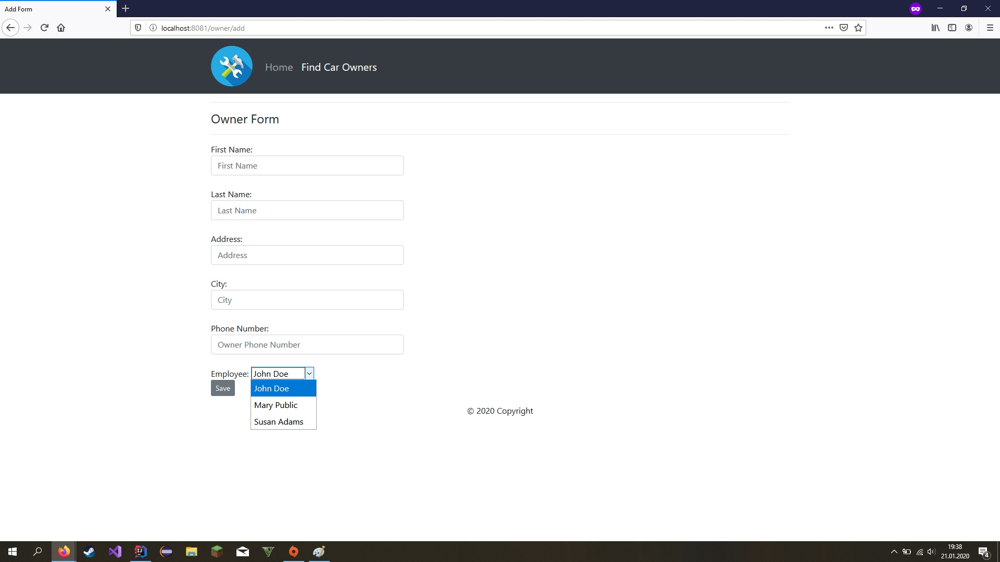
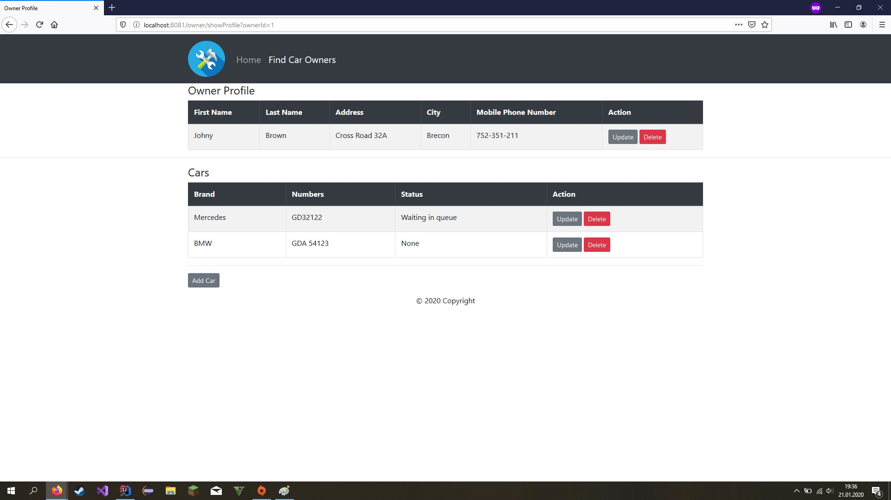
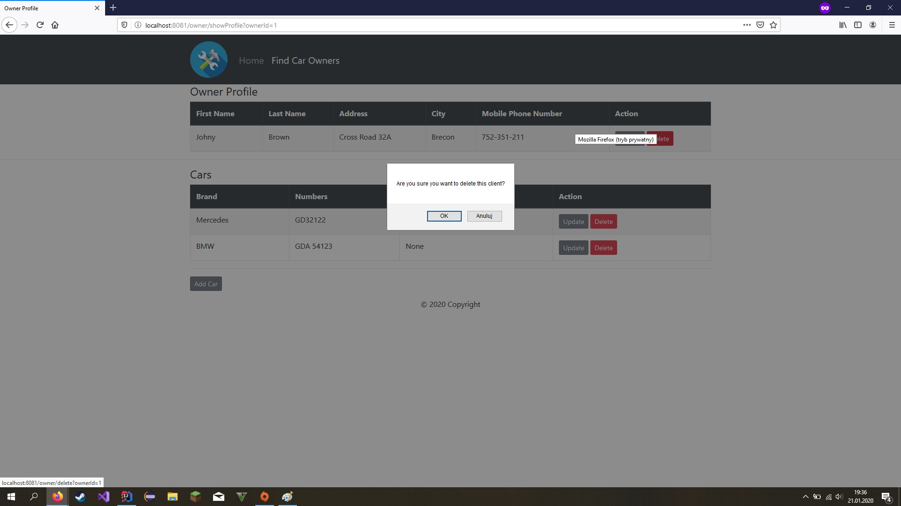
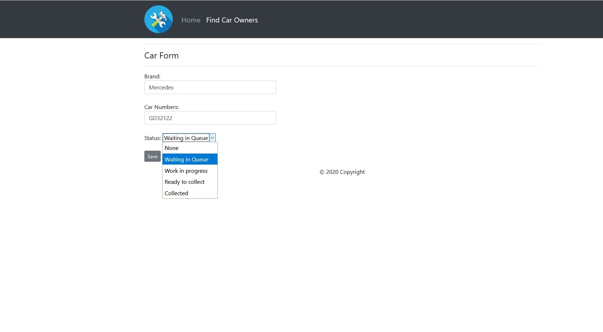
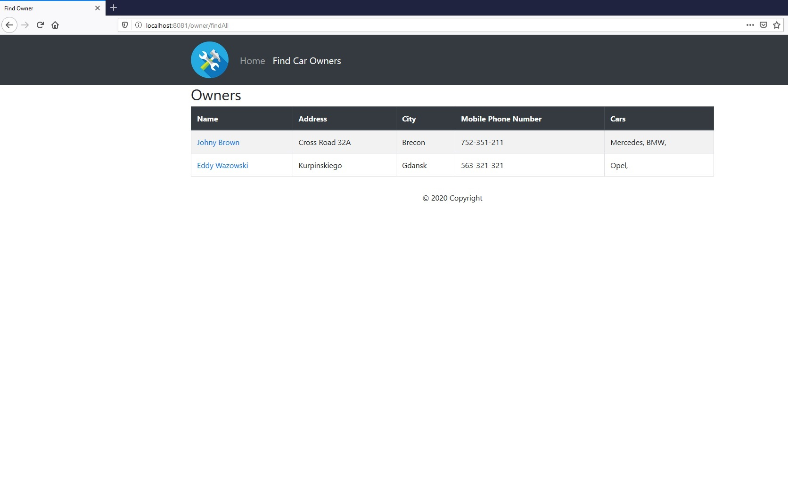

# SpringBoot Car Repair Shop App
Simple app to manage shop. :) Also with REST.

Front page:

Find Owner page:

Add Owner page:

Owner Profile page:

Update Owner page:

Delete Owner page:

Add Owner Car page:

Show All page:

